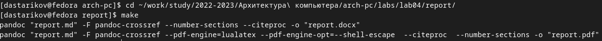

---
## Front matter
title: Отчет по лабораторной работа №4
author: Стариков Данила Андреевич
subtitle: Группа НПИбд-02-22

## Generic otions
lang: ru-RU
toc-title: "Содержание"

## Bibliography
bibliography: bib/cite.bib
csl: pandoc/csl/gost-r-7-0-5-2008-numeric.csl

## Pdf output format
toc: true # Table of contents
toc-depth: 2
lof: false # List of figures
lot: false # List of tables
fontsize: 12pt
linestretch: 1.5
papersize: a4
documentclass: scrreprt
## I18n polyglossia
polyglossia-lang:
  name: russian
  options:
	- spelling=modern
	- babelshorthands=true
polyglossia-otherlangs:
  name: english
## I18n babel
babel-lang: russian
babel-otherlangs: english
## Fonts
mainfont: PT Serif
romanfont: PT Serif
sansfont: PT Sans
monofont: PT Mono
mainfontoptions: Ligatures=TeX
romanfontoptions: Ligatures=TeX
sansfontoptions: Ligatures=TeX,Scale=MatchLowercase
monofontoptions: Scale=MatchLowercase,Scale=0.9
## Biblatex
biblatex: true
biblio-style: "gost-numeric"
biblatexoptions:
  - parentracker=true
  - backend=biber
  - hyperref=auto
  - language=auto
  - autolang=other*
  - citestyle=gost-numeric
## Pandoc-crossref LaTeX customization
figureTitle: "Рис."
tableTitle: "Таблица"
listingTitle: "Листинг"
lofTitle: "Список иллюстраций"
lotTitle: "Список таблиц"
lolTitle: "Листинги"
## Misc options
indent: true
header-includes:
  - \usepackage{indentfirst}
  - \usepackage{float} # keep figures where there are in the text
  - \floatplacement{figure}{H} # keep figures where there are in the text
---

# Цель работы

Целью работы является освоение процедуры оформления отчетов с помощью легковесного языка разметки Markdown.

# Основная часть

## Установка дополнительного ПО для выполнения лабораторной работы.

### Установка TeX Live.

С официального сайта TeX Live
<https://www.tug.org/texlive/acquire-netinstall.html> скачали архив install-tl-unx.tar.gz (Рисунок [-@fig:fig1])) и распаковали (Рисунок [-@fig:fig2])).

{ #fig:fig1 width="6.496527777777778in" height="2.1603772965879267in"}

{#fig:fig2 width="6.496527777777778in" height="0.36736111111111114in"}

Перешли в распакованную папку и запустили скрипт install-tl с root правами (Рис. [-@fig:fig3]-[-@fig:fig4]).

{#fig:fig3 width="6.496527777777778in" height="0.9527777777777777in"}

{#fig:fig4 width="6.496527777777778in" height="1.6229166666666666in"}

Добавили /usr/local/texlive/2022/bin/x86_64-linux в PATH для текущей и будущих сессий (Рисунок [-@fig:fig5]).

{#fig:fig5 width="6.496527777777778in" height="0.20625in"}

### Установка Pandoc 2.19.2 и Pandoc-crossref v0.3.13.0b

Для корректной работы устанавливаем версию Pancdoc-crossref v0.3.13.0b, совместимую с Pandoc 2.19.2 (последняя версия).

Скачиваем архив pandoc (<https://github.com/jgm/pandoc/releases>:) и
архив pandoc-crossref (<https://github.com/lierdakil/pandoccrossref/releases>:) (Рисунок [-@fig:fig6]).

{#fig:fig6 width="6.496527777777778in" height="0.37313429571303586in"}

Распаковываем оба архива ((Рисунок [-@fig:fig7]).

{#fig:fig7 width="6.496527777777778in" height="0.35060804899387576in"}

Копируем файлы pandoc и pandoc-crossref в каталог /usr/local/bin/ (Рисунок [-@fig:fig8]):

{#fig:fig8 width="6.496527777777778in" height="0.859090113735783in"}

## Выполнение лабораторной работы

1.  Генерирование файлов .docx и .pdf на основе .md

Перешли в каталог курса и актуализировали файлы из репозитория (Рисунок [-@fig:fig9]).

{#fig:fig9 width="3.938050087489064in" height="0.4792333770778653in"}

Провели компиляцию шаблона с использованием Makefile, проверили корректность полученных файлов ((Рис. [-@fig:fig10]-[-@fig:fig11]).

{#fig:fig10 width="6.496527777777778in" height="0.45in"}

{#fig:fig11 width="6.496527777777778in" height="3.4305555555555554in"}

Удалили полученные файлы (Рисунок [-@fig:fig12]).

{#fig:fig12 width="6.136272965879265in" height="1.6564807524059493in"}

2.  Создание отчета по лабораторной работе №4 в формате Markdown.

Лабораторный отчет сформирован в формате Markdown, с помощью команды make созданы копии в формате .pdf и .docx.

## Выполнение заданий для самостоятельной работы.

Создали отчет по лабораторной работе №3 в формате Markdown и загрузили на репозиторий.

# Выводы

При выполнении лабораторной работы научились пользоваться языком разметки Markdown для формирования файлов, в частности лабораторных отчетов.
